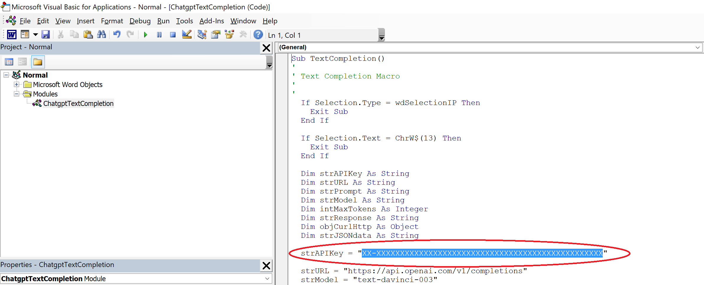

# Add ChatGPT to Microsoft Word
How to add ChatGPT's Text Completion functionality to Microsoft Word.
  

<!-- badges: start -->
<!-- badges: end -->

<!-- DESCRIPTION -->
## 1. Description

With the click of a single button you can access ChatGPT's awesome natural language capabilies in Microsoft Word
  

<!-- GETTING STARTED -->
## 2. Getting Started
### 2.1 Dependencies
- Requires an OpenAI API Key (create an account and get API Key at <a href="https://chat.openai.com">https://chat.openai.com</a>)
- Requires Microsoft 365 (<a href="https://www.microsoft.com/en-us">https://www.microsoft.com/en-us</a>)

  
    
<!-- INSTRUCTIONS -->
## 3. Instructions

There are 4 basic steps in order to add a ChatGPT button into Microsoft Word

  

### 3.1 Enable the Developer Tab

The Developer tab isn't displayed by default, but you can add it to the ribbon.

*Step 1* - On the File tab, go to Options > Customize Ribbon.

*Step 2* - Under Customize the Ribbon and under Main Tabs, select the Developer check box.

 

The latest instructions to enable the Developer Tab from Microsoft can be found here: 
<a href="https://support.microsoft.com/en-us/office/show-the-developer-tab-in-word-e356706f-1891-4bb8-8d72-f57a51146792">https://support.microsoft.com/en-us/office/show-the-developer-tab-in-word</a>

  

### 3.2 Import the ChatgptTextCompletion.bas file

*Step 1* - Download and Save the latest ChatgptTextCompletion.bas file from this repository.
 

Keep the location of where the file is saved as you will need it later. 
 

*Step 2* - On the Developer tab, click the Visual Basic button.

 

*Step 3* - On the File tab, go to Import File...

 

*Step 4* - Select the ChatgptTextCompletion.bas file and click Open

  

### 3.3 Add your OpenAI APIKey into the ChatgptTextCompletion.bas file

*Step 1* - In the Project window (Top left hand side) double click on the ChatgptTextCompletion Module.
 

*Step 2* - Replace the highlighted XX-XXXXXXXXXXXXXXXXXXXXXXXXXXXXXXXXXXXXXXXXXXXXXXXX with your APIKEY.

 

