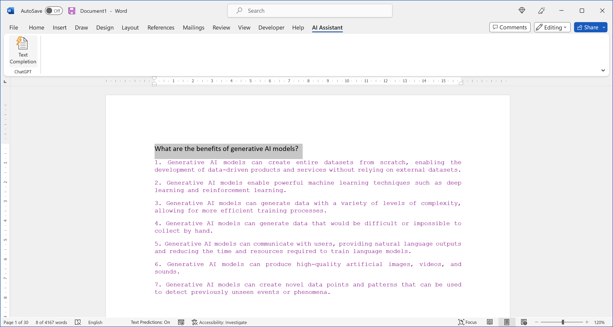
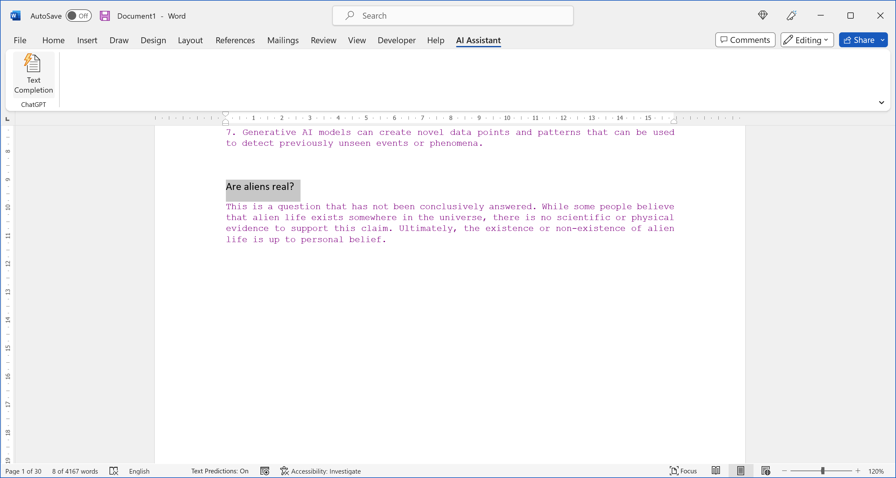
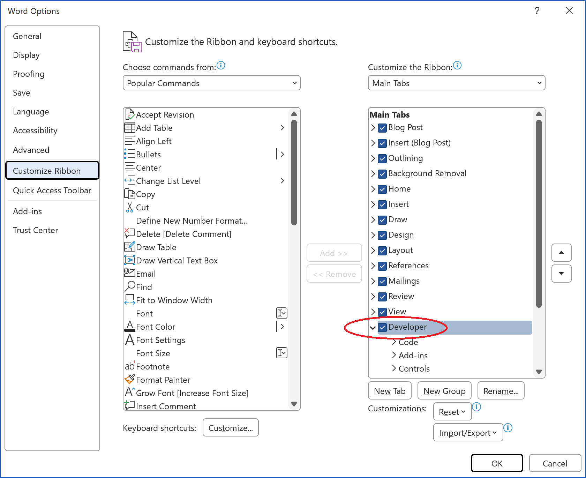
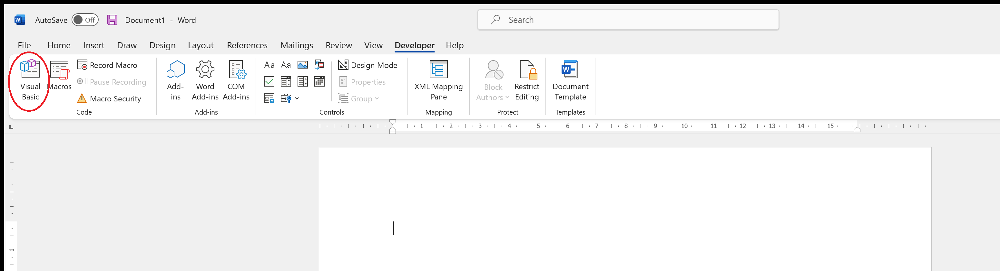
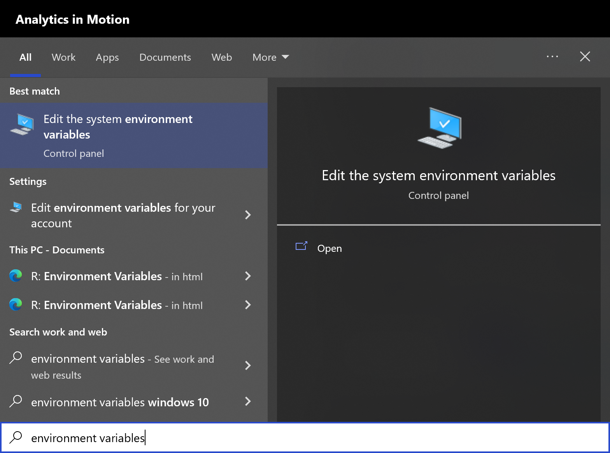
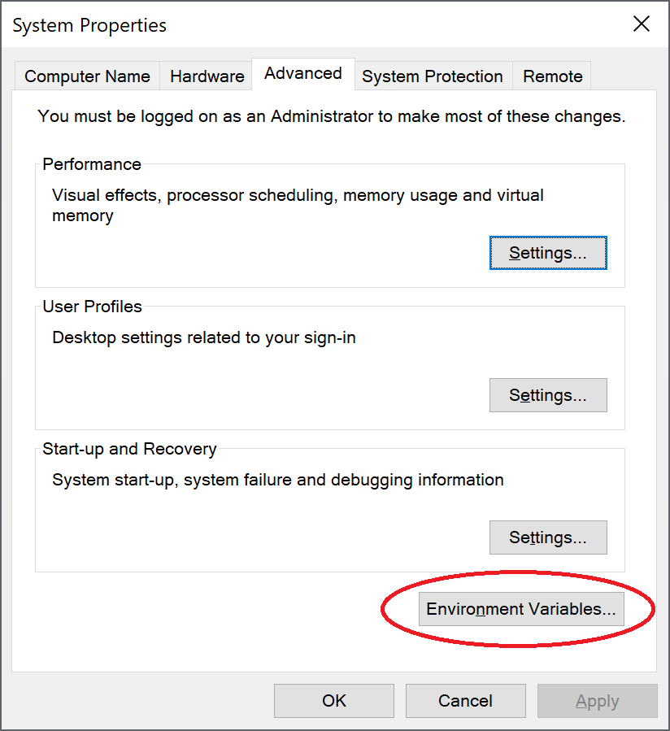
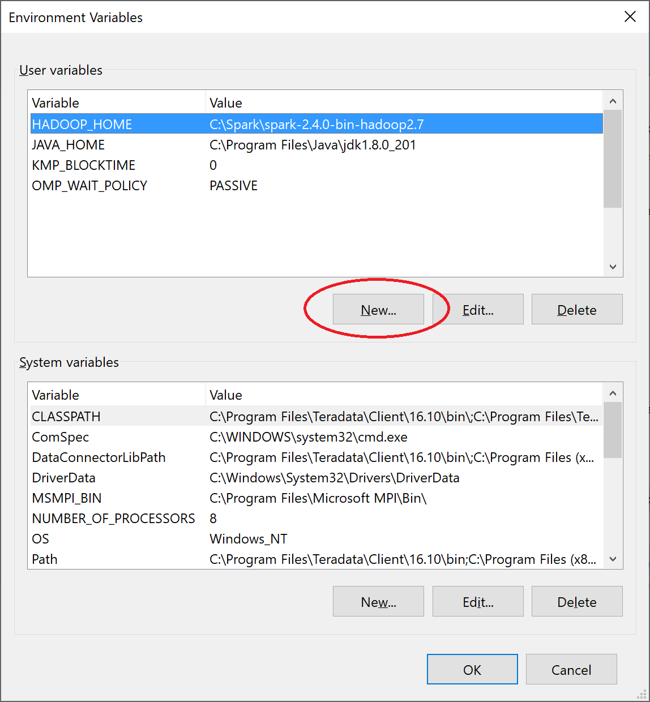
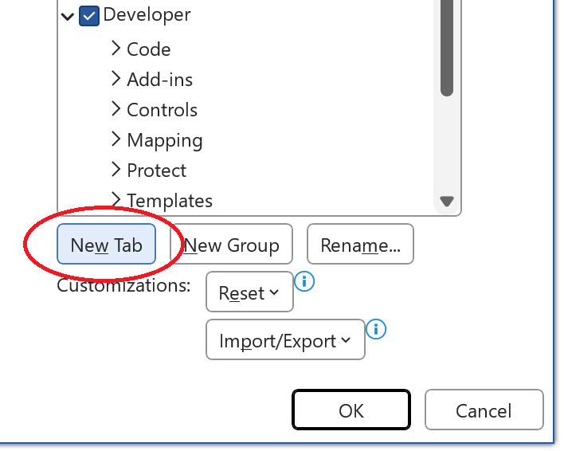
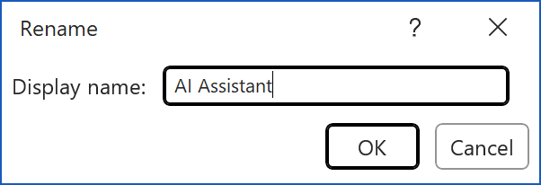
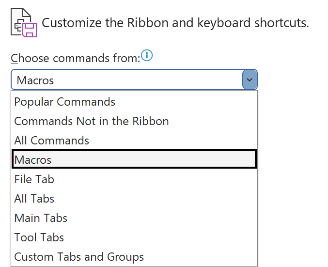

# Add ChatGPT to Microsoft Word
How to add ChatGPT's Text Completion functionality to Microsoft Word.
<br /><br />

<!-- badges: start -->
[](https://awesome.re)&nbsp;&nbsp;
[](https://github.com/analyticsinmotion/add-chatgpt-to-microsoft-word/actions/workflows/blank.yml)&nbsp;&nbsp;
[](https://github.com/analyticsinmotion/chatgpt-images-r-shiny/blob/main/LICENSE.md)&nbsp;&nbsp;
&nbsp;&nbsp;
&nbsp;&nbsp;
&nbsp;&nbsp;
&nbsp;&nbsp;
[](https://add-chatgpt-to-microsoft-word.readthedocs.io/en/latest/?badge=latest)&nbsp;&nbsp;
<!-- badges: end -->

<!-- DESCRIPTION -->
## 1. Description

With the click of a single button you can access ChatGPT's awesome natural language capabilies in Microsoft Word
<br /><br />


https://user-images.githubusercontent.com/52817125/218468803-5cdfbda3-4a5f-4d74-aaec-2a136e9b7956.mp4


<br />

<!-- GETTING STARTED -->
## 2. Getting Started
### 2.1 Dependencies
- Requires an OpenAI API Key (create an account and get API Key at <a href="https://chat.openai.com">https://chat.openai.com</a>)
- Requires Microsoft Windows 10/11 (<a href="https://www.microsoft.com/en-au/windows">https://www.microsoft.com/en-au/windows</a>)
- Requires Microsoft Word 365 (<a href="https://www.microsoft.com/en-us">https://www.microsoft.com/en-us</a>)
<br /><br />
    
<!-- INSTRUCTIONS -->
## 3. Instructions

  - Write the text you want to send to ChatGPT anywhere in Microsoft Word
  - Click the Text Completion button in the AI Assistant tab
  - Wait a few seconds for ChatGPT to respond
  - The text completion results will appear under initial request text
<br /><br />

### 3.1 Text Completion Example 1

User Input
```
What are the benefits of generative AI models?
```

ChatGPT Output


<br />

### 3.2 Text Completion Example 2

User Input
```
Are aliens real?
```

ChatGPT Output


<br />

<!-- Installation -->
## 4. Installation

There are 4 basic steps in order to add a ChatGPT button into Microsoft Word:
  1. Enable the Developer Tab
  2. Import the VBA script file
  3. Add your OpenAI APIKey
  4. Create the ChatGPT button 

Each of these steps are fully outlined below. 
<br /><br />

### 4.1 Enable the Developer Tab

The Developer tab isn't displayed by default, but you can add it to the ribbon.

**Step 1** - On the File tab, go to Options > Customize Ribbon.

**Step 2** - Under Customize the Ribbon and under Main Tabs, select the Developer check box.


<br />

The latest instructions to enable the Developer Tab from Microsoft can be found here: 
<a href="https://support.microsoft.com/en-us/office/show-the-developer-tab-in-word-e356706f-1891-4bb8-8d72-f57a51146792">https://support.microsoft.com/en-us/office/show-the-developer-tab-in-word-e356706f-1891-4bb8-8d72-f57a51146792</a>
<br /><br />

### 4.2 Import the ChatgptTextCompletion.bas file

**Step 1** - Download and Save the latest ChatgptTextCompletion.bas file from this repository.
<br />

Keep the location of where the file is saved as you will need it later.<br />
<br />

**Step 2** - On the Developer tab, click the Visual Basic button.


<br />

**Step 3** - On the File tab, go to Import File...


<br />

**Step 4** - Select the ChatgptTextCompletion.bas file and click Open
<br /><br />

### 4.3 Add your OpenAI APIKey into Windows

**Step 1** - Open the Start menu and start typing "environment variables". When the best match appears click "Edit the system environment variables" result.


<br />

**Step 2** - Click the "Environment variables" button under the "Advanced" tab.


<br />

**Step 3** - Create a new user variable by clicking "New" under the "User Variables" section.


<br />

**Step 4** - Type the variable name **OPENAI_API_KEY** in the first field and your OpenAI APIKEY in the variable value field. Then click OK.


<br />

**Step 5** - **IMPORTANT** You must restart Windows to apply the new environment variable
<br /><br />

### 4.4 Add your ChatGPT button into the Microsoft Word Ribbon

**Step 1** - Add a new tab
<br />
  - On the File tab, go to Options > Customize Ribbon
  - Click New Tab
<br />


<br />

 **Step 2** - Rename the New Tab to **AI Assistant**


<br />

**Step 3** - Rename New Group (Custom) to **ChatGPT**


<br />

**Step 4** - Select Macros in the Choose Commands from dropdown box


<br />

**Step 5** - Select the ChatgptTextCompletion Macro and click Add >>


<br />


**Step 6** - Rename button to **Text Completion**, select a Symbol and click OK


<br />

After the preceding steps have been completed the Microsoft Word screen should look like the following:


<br />

<!-- Best Practices for API Key Safety -->
## 5. Best Practices for API Key Safety

Your OpenAI APIKEY key/s should be kept secure and private at all times.

Please follow the best practices guide for API security from OpenAI 
<br />
<a href="https://help.openai.com/en/articles/5112595-best-practices-for-api-key-safety">https://help.openai.com/en/articles/5112595-best-practices-for-api-key-safety</a>
